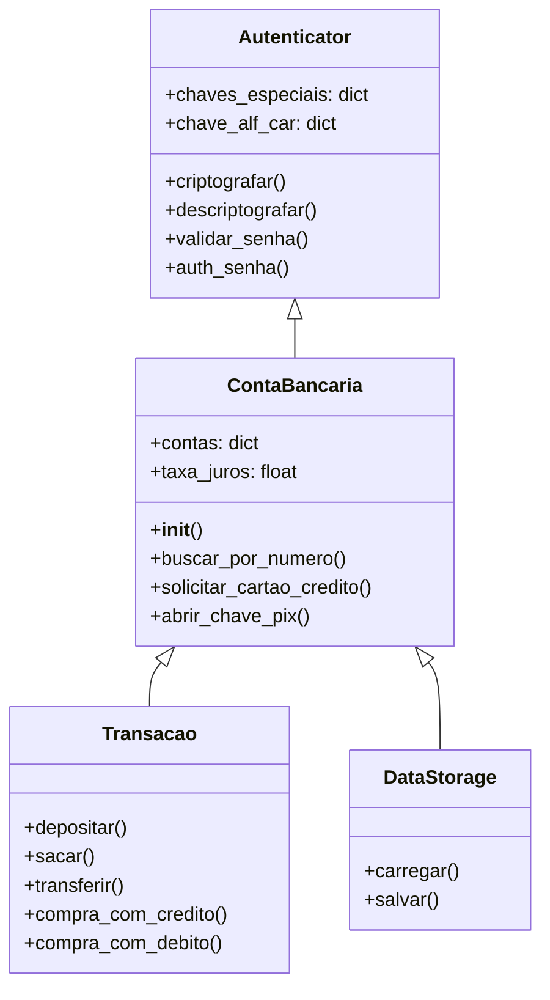

# Sistema Bancário em Terminal (Python)

Um sistema bancário completo com operações CRUD, autenticação segura e persistência de dados, totalmente operacional no terminal.

## 🚀 Funcionalidades Principais

- **Autenticação Segura**
  - Criptografia/Descriptografia de senhas
  - Validação de força de senhas
  - Limite de tentativas

- **Operações Bancárias**
  - Depósitos, saques e transferências (PIX/TED)
  - Cartão de crédito com limite calculado
  - Controle de dívidas e parcelamento
  - Extrato detalhado com histórico

- **Gerenciamento de Conta**
  - Bloqueio/desbloqueio de conta
  - Cadastro de chaves PIX (CPF/Email/Telefone)
  - Cálculo de juros
  - Persistência em JSON

## ⚙️ Tecnologias

- Python 3.x
- Módulos padrão:
  - `json` para armazenamento
  - `re` para validação de padrões
  - `datetime` para registros temporais
- Criptografia customizada com substituição de caracteres

## 📋 Estrutura de Classes

## 🔒 Segurança
- Todas as senhas são criptografadas antes do armazenamento
- Validação rigorosa de:
  - Formato de chaves PIX
  - Força de senhas (requer 2+ caracteres especiais e números)
  - Bloqueio após 3 tentativas falhas

# 📌 Melhorias Futuras
- Adicionar interface web com Flask/Django
- Implementar banco de dados SQL
- Adicionar sistema de investimentos
- Criar relatórios PDF

#### Note: Projeto desenvolvido para fins educacionais, demonstrando conceitos avançados de POO em Python.
