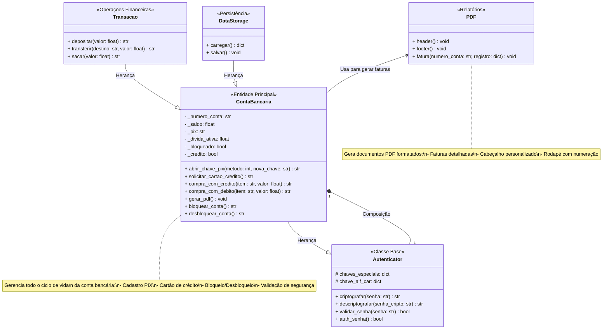

# Sistema Bancário em Terminal (Python)

Um sistema bancário completo com operações CRUD, autenticação segura e persistência de dados, totalmente operacional no terminal.

## 🚀 Funcionalidades Principais

- **Autenticação Segura**
  - Criptografia/Descriptografia de senhas
  - Validação de força de senhas
  - Limite de tentativas

- **Operações Bancárias**
  - Depósitos, saques e transferências (PIX/TED)
  - Cartão de crédito com limite calculado
  - Controle de dívidas e parcelamento
  - Extrato detalhado com histórico

- **Gerenciamento de Conta**
  - Bloqueio/desbloqueio de conta
  - Cadastro de chaves PIX (CPF/Email/Telefone)
  - Cálculo de juros
  - Persistência em JSON

## ⚙️ Tecnologias

- Python 3.x
- Módulos padrão:
  - `json` para armazenamento
  - `re` para validação de padrões
  - `datetime` para registros temporais
- Criptografia customizada com substituição de caracteres

## 📋 Estrutura de Classes

```mermaid
classDiagram
    direction BT
    
    class Autenticator {
        <<Classe Base>>
        # chaves_especiais: dict
        # chave_alf_car: dict
        + criptografar(senha: str) str
        + descriptografar(senha_cripto: str) str
        + validar_senha(senha: str) bool
        + auth_senha() bool
    }

    class ContaBancaria {
        <<Entidade Principal>>
        - _numero_conta: str
        - _saldo: float
        - _pix: str
        - _divida_ativa: float
        - _bloqueado: bool
        - _credito: bool
        + abrir_chave_pix(metodo: int, nova_chave: str) str
        + solicitar_cartao_credito() str
        + compra_com_credito(item: str, valor: float) str
        + compra_com_debito(item: str, valor: float) str
        + gerar_pdf() void
        + bloquear_conta() str
        + desbloquear_conta() str
    }

    class Transacao {
        <<Operações Financeiras>>
        + depositar(valor: float) str
        + transferir(destino: str, valor: float) str
        + sacar(valor: float) str
    }

    class DataStorage {
        <<Persistência>>
        + carregar() dict
        + salvar() void
    }

    class PDF {
        <<Relatórios>>
        + header() void
        + footer() void
        + fatura(numero_conta: str, registro: dict) void
    }

    Autenticator <|-- ContaBancaria : Herança
    ContaBancaria <|-- Transacao : Herança
    ContaBancaria <|-- DataStorage : Herança
    ContaBancaria --> PDF : Usa para gerar faturas
    ContaBancaria "1" *-- "1" Autenticator : Composição

    note for ContaBancaria "Gerencia todo o ciclo de vida\n da conta bancária:\n- Cadastro PIX\n- Cartão de crédito\n- Bloqueio/Desbloqueio\n- Validação de segurança"
    note for PDF "Gera documentos PDF formatados:\n- Faturas detalhadas\n- Cabeçalho personalizado\n- Rodapé com numeração"
```

## 🔒 Segurança
- Todas as senhas são criptografadas antes do armazenamento
- Validação rigorosa de:
  - Formato de chaves PIX
  - Força de senhas (requer 2+ caracteres especiais e números)
  - Bloqueio após 3 tentativas falhas

# 📌 Melhorias Futuras
- Adicionar interface web com Flask/Django
- Implementar banco de dados SQL
- Adicionar sistema de investimentos
- Criar relatórios PDF

#### Note: Projeto desenvolvido para fins educacionais, demonstrando conceitos avançados de POO em Python.
